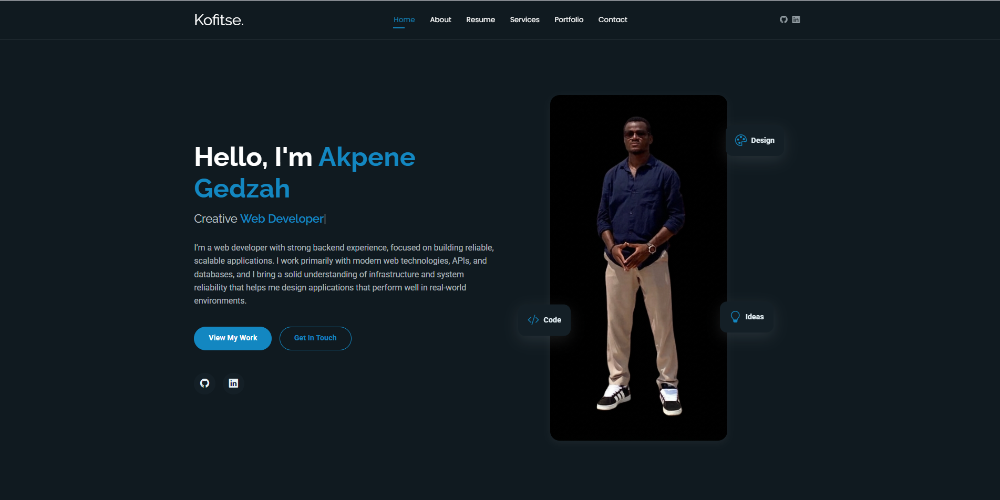

## Hi there 👋, I'm Akpene Gedzah

**Systems Integration and Software Engineer | Ghana**

I am a motivated and adaptable Software and Systems Integration Engineer with a strong foundation in computer science, software development, server configuration, and IT support. I demonstrate excellent teamwork, leadership, and problem-solving abilities with a commitment to delivering efficient technical solutions.

---

### 🚀 About Me

- 🔭 I’m currently working as a **Systems Integration Engineer / Software Engineer** at **Intelligent Building Solution**, focusing on building automation systems and deploying software solutions.
- 🌱 I’m experienced in **System Integration, IT Support, Troubleshooting, and Software Deployment**.
- 💼 Previously worked as an IT Support Officer at **The Trust Hospital Limited**.
- 🎓 Holds a **BSc in Computer Science** from Kwame Nkrumah University of Science and Technology (KNUST).
- 📫 How to reach me: [gedzahakpene@gmail.com](mailto:gedzahakpene@gmail.com)

---

### 🛠️ Technical Skills

- **Programming Languages:** Python, JavaScript, PHP
- **Web Technologies:** HTML5, CSS3, Bootstrap 5, Django
- **Databases:** MSSQL, SQLite3
- **Soft Skills:** Team player, good communication, leadership, and coordination

---

### 💼 Professional Experience

- **Systems Integration Engineer / Software Engineer** @ Intelligent Building Solution *(Dec 2024 - Present)*
  - Integrated building automation systems and deployed software solutions.
  - Configured servers, performed system testing, and handled application deployments.
- **IT Support Officer** @ The Trust Hospital Limited *(Nov 2023 - Nov 2024)*
  - Monitored IT infrastructure, diagnosed issues, and performed routine maintenance.
- **Intern** @ Any IT Solution Ghana Limited *(Nov 2021 - Dec 2021)*

---

### 🎓 Education

- **BSc Computer Science**, Kwame Nkrumah University of Science and Technology (KNUST) *(2019 - 2023)*
- **General Science**, Achimota School *(2016 - 2019)*

---

### 🌐 My Portfolio

Check out my personal portfolio website built with **Django** and **Bootstrap 5**, showcasing my professional experience, projects, and services! It features dynamic routing for service details, portfolio case studies, and a fully functional contact form.

[Live Demo](https://kofitse.pythonanywhere.com)

---

### 🤝 Let's Connect

I'm passionate about technology and constantly learning new things. I'm open to collaborations, freelance work, and connecting with fellow developers.

Feel free to reach out via email or connect with me on other platforms:

- **Email**: [gedzahakpene@gmail.com](mailto:[EMAIL_ADDRESS])
- [GitHub](https://github.com/Gedzah)
- [LinkedIn](https://www.linkedin.com/in/gedzah-akpene-kofitse/)

---

### Thank you for visiting my profile!
